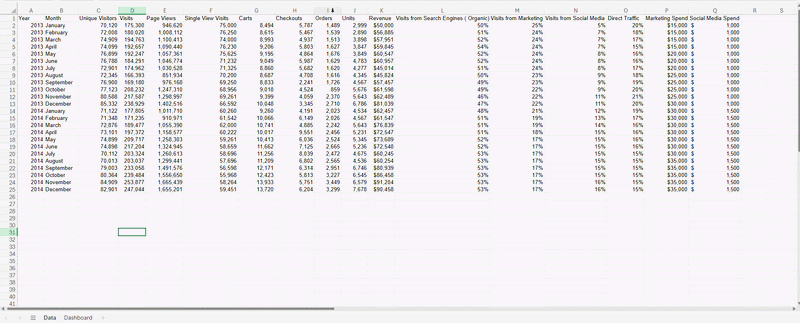

# Building Insightful Reports

This exercise demonstrates how raw metrics can be transformed into **clear business insights and actionable recommendations**.
Rather than reporting numbers in isolation, each KPI is treated as a **business question** that decision-makers care about.

The structure used throughout this activity follows the **Business Insight Creation Process** taught in the Digital Analytics course:

**1. Lead Statement** – What does the KPI really mean in plain business language?

**2. Supporting Evidence** – What data and context explain this result?

**3. Recommendation** – What actions should the business take next?

---

| KPI                           | Lead Statement                                                                                                                                         | Supporting Evidence                                                                                                                                                                                                                    | Recommendation                                                                                                                                                                                                                            |
| :---------------------------- | :----------------------------------------------------------------------------------------------------------------------------------------------------- | :------------------------------------------------------------------------------------------------------------------------------------------------------------------------------------------------------------------------------------- | :---------------------------------------------------------------------------------------------------------------------------------------------------------------------------------------------------------------------------------------- |
| Cart abandonment rate is 60%  | Nearly 6 out of 10 customers who add items to their cart leave without completing a purchase, indicating significant friction in the checkout process. | Funnel analysis showing sharp drop-off at checkout stages, high exit rates on payment and shipping pages, comparison to industry benchmark (~70% is average but improvable), device segmentation showing higher abandonment on mobile. | Short term: Simplify checkout and remove unnecessary form fields. Medium term: Add trust signals (security badges, clear return policy). Long term: Optimize mobile checkout experience and introduce saved carts or re-marketing emails. |
| Units per order is 1.2        | Customers typically purchase only one item per order, suggesting limited cross-selling or bundling effectiveness.                                      | Order data showing low average units per transaction, product-level analysis revealing few multi-item purchases, comparison to past periods or similar retailers with higher basket sizes.                                             | Short term: Add “related products” and “frequently bought together” prompts. Medium term: Introduce bundle discounts or volume pricing. Long term: Personalize product recommendations based on browsing and purchase history.            |
| Social Media Lead Ratio is 5% | Only 5 out of every 100 social media visitors become leads, indicating weak conversion from social traffic.                                            | Social channel reports showing high engagement but low lead submissions, landing page conversion rates for social traffic, comparison with email or paid search lead ratios.                                                           | Short term: Improve social landing pages with clearer CTAs. Medium term: Test lead-focused campaigns (e.g., gated content, contests). Long term: Refine audience targeting and align social messaging more closely with user intent.      |
| Share of impression is 10%    | The brand is visible in only 1 out of 10 potential ad impressions, limiting reach and awareness in competitive markets.                                | Paid search impression share reports, keyword-level analysis showing lost impressions due to budget or rank, comparison to top competitors.                                                                                            | Short term: Increase bids on high-performing keywords. Medium term: Improve Quality Score through better ad relevance and landing pages. Long term: Expand keyword strategy and allocate higher budget to priority campaigns.             |
| Email conversion rate is 2%   | Only 2% of email recipients complete a desired action, indicating missed opportunities to drive conversions.                                           | Email campaign performance data, open vs. click vs. conversion funnel, A/B test results on subject lines or CTAs, comparison to historical performance.                                                                                | Short term: Improve CTAs and simplify email messaging. Medium term: Segment email lists based on user behavior. Long term: Implement personalized and automated email journeys.                                                           |

---

## Key Takeaways

- Metrics alone do not create value — **insight and context do**
- Lead statements translate analytics into **language executives understand**
- Supporting evidence explains **why performance looks the way it does**
- Recommendations focus on **action**, not just observation

This approach aligns with best practices for **executive dashboards and analyst reporting**, ensuring that insights lead directly to better decision-making.

---

## Reflection: What I Learned from This Exercise

This exercise reinforced that **analytics is not about reporting numbers**, but about **answering business questions clearly and confidently**.

I learned how to:

- Translate KPIs into **plain-language insights** that non-technical stakeholders can understand
- Focus on **what matters most**, instead of overwhelming decision-makers with too much data
- Use context such as **funnels, benchmarks, trends, and segmentation** to explain why performance looks the way it does
- Structure recommendations so they are a**ctionable, realistic, and prioritized**

Most importantly, this task highlighted the analyst’s role as a **storyteller and problem solver**, not just a data provider.

---

## Portfolio Context

This project is presented as a **mini analytics case study**, simulating how an analyst would communicate insights to executives and marketing teams.

It demonstrates my ability to:

- Apply **Digital Analytics theory** to realistic business scenarios
- Write **executive-ready lead statements**
- Connect KPIs to **business impact**
- Propose **short-, medium-, and long-term recommendations**
- Follow industry best practices inspired by Avinash Kaushik’s **action-focused reporting approach**

This type of structured insight delivery is applicable to:

- Executive dashboards
- Marketing performance reports
- CRO (Conversion Rate Optimization) analysis
- Ongoing KPI monitoring
